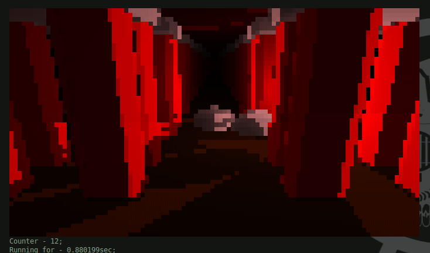

# Terminal Raymarching
Rendering 3D objects in the terminal; Hillarity ensues.

## Milestones

Fully rendered distance map.

Succesfully calculated light value based on the normals and light strength(red), distance fog(green), and shadows(blue)

Object material detection.

Object manipulation.

Infinite pillairs.

Fully furnished scene.

## How it works
...
