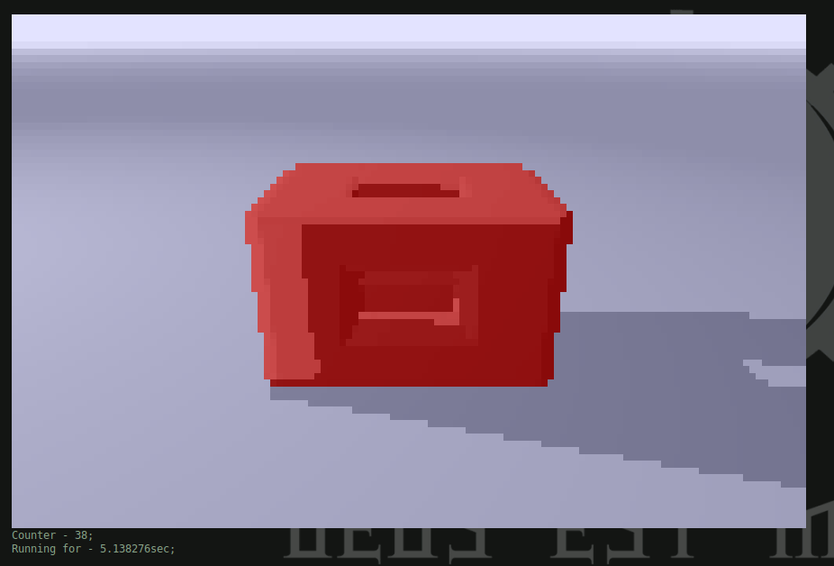

# Terminal Raymarching
Challenged to render 3D objects in the terminal; Hillarity ensues.

## Milestones

Fully rendered distance map.

Succesfully calculated light value based on the normals and light strength(green), distance fog(red), and shadows(blue)

Object material detection.

Object manipulation.

Infinite pillairs.

Fully furnished scene.

## How it works
### Canvas
#### Block character
So, initially the idea was to use full block character(█) as an overgrown pixel. The color was edited using ANSI codes. Typically, the [color range](https://talyian.github.io/ansicolors/) would be limited, but it just so happened that `st` is a true color terminal. This means that I could set any RGB color with the `\x1b[38;2;r;g;bm` ANSI code.

// Image pending

Using a bit of vector magic I got the shader equivalent of "Hello world!" to work. And while it looked alright, I was bothered by the resolutions available. I could push canvas width all the way to 200 characters, but could only have 50 characters of height. A maximum resolution of 200x50 px; rather underwhelming.

However, something dawned on me while I was playing around with the screen dimensions. Typically, a character in terminal can have both its foreground and background color set. Background color would be useles with the full block character, since the character would simply cover it. But what if, there were a half block character; and it turns out there is(▄).

// Image pending

With this the screen height was doubled, and 200x100px was not looking bad at all.

Alas, up till this point, all that was achived was a static image. But with a simple loop more could be done. The only question was how to refresh the screen?

#### Animating
As I was doing this, a friend of mine(@cathalogue) suggested I check out the vim source code. Specifically, the [term.c](https://github.com/vim/vim/blob/master/src/term.c) file. This file defines all the ANSI codes that make vim tick. After scrolling for a while, I managed to find a working clear screen code. I put all my code into a loop and made it clear the screen after each render, and... the screen tear was readly apparent. 

It occured to me that maybe calling `printf()` to print a larger chunk of the screen less often was more performant than calling it on every single character. And so, I went ahead and buffered the output before the print. The results were undeniable. Screen tear was greatly reduced.

However, there was another problem, and that problem was due to clearing the screen. Because the drawing of the "pixels" went from left to right, top to bottom, the bottom right corrner would take more time to be reached by the rendering cursor. As a result, that area would take a bit longer to update. Clearing the screen makes this latency obvious; since it resets all the pixels, that area spends more time with no value.

So I went back to vim's `term.c` in search of a more fitting code. Then, I stumbled upon the "move cursor" ANSI code. If instead of clearing the screen, we zero out the cursor; return it to the begining, and then draw the next frame. Then, the troubled area would be a bit out dated every frame, but at least it would have a value. That way the redraw would not be as, if at all, noticable. By looking at the examples, you can see that I was correct.

### Raymarching
